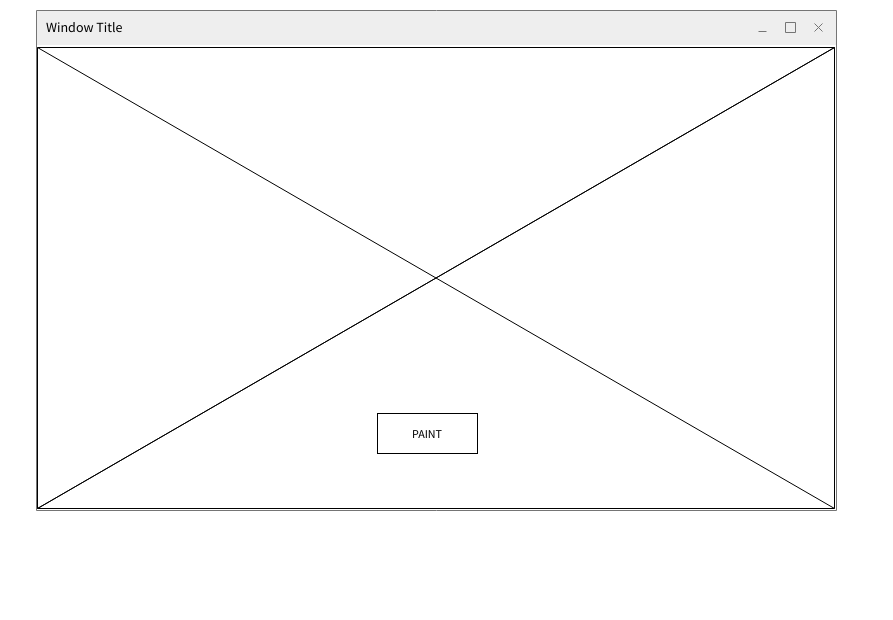
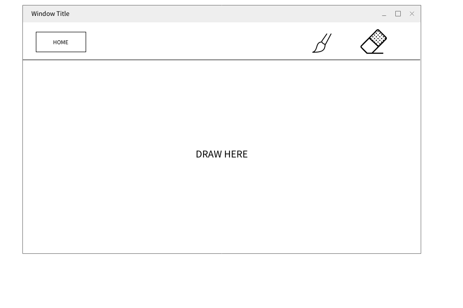
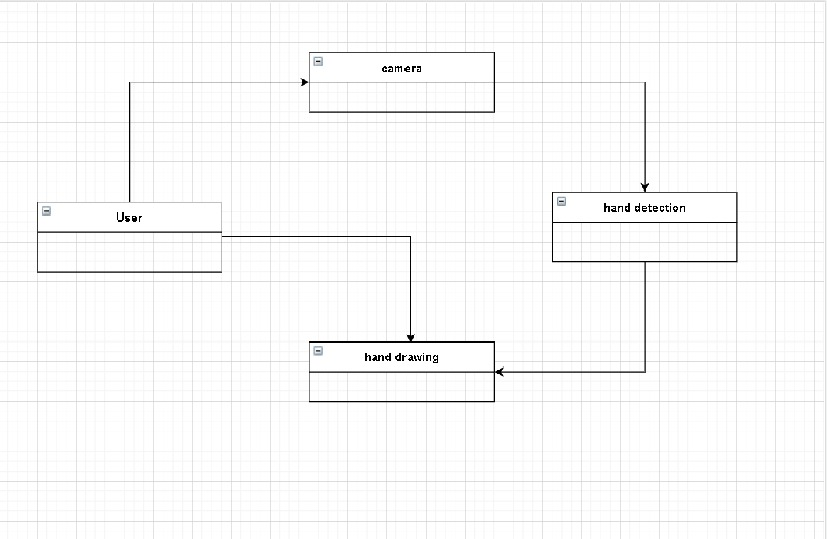

# Easy Hand Paint.

### Team Member
- Ruba Kanaan
- Leen Hazaimeh.
- Ahmad Abu Dames.
- Khaled Al-Shishani
- Abdullah Elian

 
 

## Overview
Our hand tracking software captures all the subtlety and complexity of natural hand movements. It's based on a decade of development and iteration, generations of research in artificial intelligence. We will provide a tool for the user to draw directly on the screen by his/her hand, which will save a lot of time instead of using the mouse to draw.

 
 

### User stories

* As a user, I want to draw without using the mouse.
* As a user, I want to an easy app to draw on it.
* As a user, I want to erase the drawing if i made a mistake. 
* As a user, I want to draw with diffrent colors.
* As a user, I want to see my hand when i'm a drawing.

 
 

### Features:
- Detect hand using the camera.
- Detect hand movement. 
- Drawing a shape following the hand.

 
 

### Stretch goals:

- Detect the shape of the user drawing and draw the matching shape automatically.

- Erase the drawing (do /undo).

- Choose colors for painting.

 
 

### Acceptance Tests
- Ensure that the user can open the camera.
- Ensure that the hand is detected.
- Ensure that the user can draw on the screen.

 
 

### Wireframe

* 

 
 

* 

 
 

## Domain Modeling

